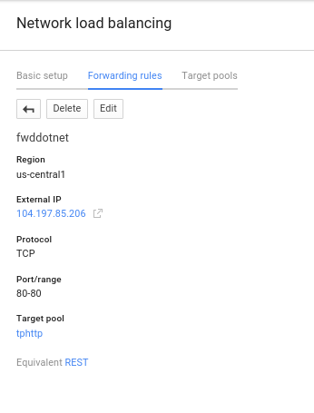
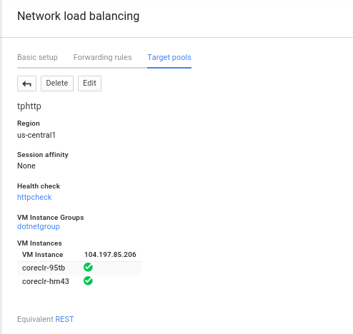
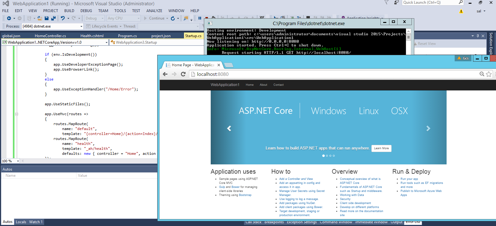

## .NET on GCP

####  samples provided as-is without warranty

Sample code demonstrating running trivial .NET web applications on Google Cloud Platform services.  These simply builds off of existing technologies and samples but configures it to run on GCP effeciently with healh checking and load balancing.  

The example here uses Microsofts's [.NET Core 1.0.0](https://www.microsoft.com/net/core) RC/preview (dotnet-dev-1.0.0-preview2-003121).  The soruce [Dockerfile](WebApplication1/src/Dockerfile) is provided below

The sample contained here is confirmed to run against the current preview release

**[microsoft/dotnet:1.0.0-preview1](https://hub.docker.com/r/microsoft/dotnet/)**

in project.json:
```
"Microsoft.NETCore.App": {
   "type": "platform",
   "version": "1.0.0"
}
```
You can use Visutal Studio 2015 to create and extend the sample from scratch.  VS2015 
* **WebApplication1**
    Default webapplication generated by Visual Studio 2015: 
    "New Project 
     * C# 
       * Web 
         * ASP.NET Core Web Application (.NET Core) ;  (Change Authenticaiton --> No Authentication)

The platforms that are domstrated here are:

* [Appengine](#appengine)
* [ContainerEngine](#containerengine)
* [ContainerVM](#containervm)


***  


### Basic Configuration
Sample application simply spins up inside a Docker container an runs Kestrel to host the application.  The sample is modified from the baseline in the following way to run with healthchecks in GCP:

* port:  8080
* GET requests to endpoint */_ah/healh* must return a *200* OK HTTP response
* Use [Kestrel Webserver](https://github.com/aspnet/KestrelHttpServer)

***  


##### WebApplication1

To run the code directly from the source dockerhub image:

```bash
docker run -p 8080:8080 docker.io/salrashid123/mvc
```

or as rkt (note, your rkt ip will bind to something else)

```bash
sudo rkt run --insecure-options=image docker://salrashid123/mvc
```
```
rkt list
UUID		APP	IMAGE NAME					STATE	CREATED		STARTED		NETWORKS
36a7ac5b	mvc	registry-1.docker.io/salrashid123/mvc:latest	running	4 seconds ago	4 seconds ago	default:ip4=172.16.28.19

curl http://172.16.28.19:8080
```

To build from the git repo

```
cd WebApplicaton1
docker build -t mvc .
docker run -t -p 8080:8080 mvc
```

As reference, the following files were modified to listen on :8080 and for healthchecks on `/_ah/health`:

* [Startup.cs](WebApplication1/src/WebApplication1/Startup.cs)
* [Program.cs](WebApplication1/src/WebApplication1/Program.cs)
* [Controllers/HomeController.cs](WebApplication1/src/WebApplication1/Controllers/HomeController.cs)
* [Views/Health.cshtml](WebApplication1/src/WebApplication1/Views/Home/Health.cshtml)
* [project.json](WebApplication1/src/WebApplication1/project.json)
* [Dockerfile](WebApplication1/Dockerfile)
* [global.json](WebApplication1/global.json)
* [hosting.json](WebApplication1/src/WebApplication1/hosting.json)

***  

To run localy without Docker, install dotnet-dev-1.0.0-preview2-003121 as shown in the [Dockerfile](WebApplication1/Dockerfile) and off of the microsoft .net [install guides] (https://www.microsoft.com/net/core#ubuntu).
  Once installed, then,
  ```
  cd src\WebApplication1\
  dotnet restore
  dotnet run
  ```

#### Deploying

Deploying to GCP requires your gcloud environment to get setup:

```bash
gcloud auth login
gcloud config set project <your_project>
```


#####AppEngine

Deploying to GAE is pretty simple:
```bash
gcloud preview app deploy app.yaml
```

Then, 
`http://your_project.appspot.com`

#####ContainerEngine

To deploy on GKE, you need to setup the replication controllers and frontend loadbalancer services as well as a small cluster.

**Note** in the example below, the configuration ponts to a public image for the above two examples. You can configure your own private repository or use [Google Container Registry](https://cloud.google.com/container-registry/).

The prebuilt image is on docker.io registry under:

* **WebApplication1**:  [docker.io/salrashid123/mvc](https://hub.docker.com/r/salrashid123/mvc/)


######Replication Controllers
**web-rc.yaml**
(edit the *image* section in the yaml below to use a different referenced image)
```yaml
apiVersion: v1
kind: ReplicationController
metadata:
  name: web-rc
  labels:
    type: web-type
spec:
  replicas: 2
  template:
    metadata:
      labels:
        type: web-type
    spec:
      containers:
      - name: web-container
        image: salrashid123/mvc
        imagePullPolicy: IfNotPresent
        ports:
        - containerPort: 8080
          protocol: TCP
```


#####Services
**web-svc.yaml**
```yaml
apiVersion: v1
kind: Service
metadata:
  name: web-srv
  labels:
    type: web-type
spec:
  type: LoadBalancer
  ports:
  - name: web
    port: 80
    protocol: TCP
    targetPort: 8080
  selector:
    type: web-type
```

######Set the Runnng zone
```bash
gcloud config set compute/zone us-central1-a
```

######Create a Firewall rule
```
gcloud compute firewall-rules create allow-http --allow tcp:80

NAME       NETWORK SRC_RANGES RULES  SRC_TAGS TARGET_TAGS
allow-http default 0.0.0.0/0  tcp:80
```

*Note*  The above service maps port 80 --> 8080 in the container and sets the firewall rules apprpriately.  If you want to directly use 8080 throughout, modify the services file and firewall rule.

######Create a GKE Cluster
```
gcloud beta container clusters create cluster-1 --num-nodes 2

NAME       ZONE           MASTER_VERSION  MASTER_IP      MACHINE_TYPE   STATUS
cluster-1  us-central1-a  1.0.6           104.197.76.93  n1-standard-1  RUNNING
```

######List instances in the Cluster
```
gcloud compute instances list
```


######Create ReplicationController and Services
```
kubectl create -f web-rc.yaml
kubectl create -f web-srv.yaml
```

######List nodes, pods, replication controllers and services
```
kubectl get no
NAME            LABELS           STATUS
gke-cluster-1-e997c6b4-node-38so   kubernetes.io/hostname=gke-cluster-1-e997c6b4-node-38so   Ready
gke-cluster-1-e997c6b4-node-knp6   kubernetes.io/hostname=gke-cluster-1-e997c6b4-node-knp6   Ready

kubectl get po
NAME           READY     STATUS    RESTARTS   AGE
web-rc-lfvky   1/1       Running   0          2m
web-rc-mcrg3   1/1       Running   0          2m

kubectl get rc
CONTROLLER   CONTAINER(S)    IMAGE(S)           SELECTOR        REPLICAS
web-rc       web-container   salrashid123/mvc   type=web-type   2

kubectl get svc
NAME         LABELS        SELECTOR        IP(S)                   PORT(S)
kubernetes   component=apiserver,provider=kubernetes 10.167.240.1  443/TCP
web-srv      type=web-type type=web-type   10.167.251.162          80/TCP
                                           104.197.194.190 <<<<<<<<<<<<<<<<<

```

**Note:**  The service lists the public IP address of the LoadBalancer (it may take a couple of minutes to provision it).

Now that we have a public ip, the service is available 

`http://104.197.194.190`

#####ContainerVM

Container VMs simply spin up one container per GCE instance with docker already installed and the instructions to strartup the image thats specified. 

The following insruction set setups a managed instance group, healthcheck and loadbalancer.  You can use the managed instance group to later auto (or manually) scale the number of VMs up or down

For more information, see: [ContainerVM](https://cloud.google.com/compute/docs/containers/container_vms)

The Container VM is defined by the following yaml file:

**containers.yaml**
```yaml
version: v1
kind: Pod
metadata:
  name: web 
spec:
  containers:
    - name: web
      image: salrashid123/mvc
      imagePullPolicy: Always
      ports:
        - containerPort: 8080
          hostPort: 80
          protocol: TCP
  restartPolicy: Always
  dnsPolicy: Default
```


Create the firewall rule, instance template, helthcheck and target pool
```bash
gcloud compute firewall-rules create allow-http --allow tcp:80

gcloud compute instance-templates create dotnet \
    --image container-vm \
    --tag dotnetserver \
    --metadata-from-file google-container-manifest=containers.yaml \
    --machine-type f1-micro

gcloud compute http-health-checks create httpcheck \
    --port 80 --request-path "/_ah/health" 

gcloud compute  target-pools create tphttp \
    --health-check httpcheck --region us-central1
```

*Note*  The above service maps port 80 --> 8080 in the container and sets the firewall rules apprpriately.  If you want to directly use 8080 throughout, modify containers.yaml file, the firewall rule and the healthcheck port.

Then setup the actual forwarding rule.  Note he IP address
```
gcloud compute forwarding-rules create fwddotnet \
    --region us-central1 --ip-protocol TCP \
    --port-range 80 --target-pool tphttp

NAME      REGION      IP_ADDRESS     IP_PROTOCOL TARGET
fwddotnet us-central1 104.197.85.206 TCP         us-central1/targetPools/tphttp
```

**Note** the IP address for the forwarding rule **104.197.85.206**

The example above uses a GCP [Network LoadBalancer](https://cloud.google.com/compute/docs/load-balancing/network/).  Since we are using HTTP only, the alternative could be to stup an [HTTP LoadBalancer](https://cloud.google.com/compute/docs/load-balancing/http/).

```
gcloud compute instance-groups managed create dotnetgroup \
    --zone us-central1-a --base-instance-name coreclr \
    --size 2 --template dotnet \
    --target-pool tphttp

NAME ZONE  BASE_INSTANCE_NAME SIZE TARGET_SIZE GROUP       INSTANCE_TEMPLATE AUTOSCALED
dotnetgroup us-central1-a coreclr                 2           dotnetgroup dotnet

```


You should see the instance group up, running and available for traffic:






Finally, the service should be available at the port for the forwarding rule:

`http://104.197.85.206`


#### Building Locally
The easiest way to extend these samples is to generate the docker images and test the images themselves.

Optionally, if you want to extend and deploy these images locally, you will need docker.  Running the images directly inside docker mimics the deployment runtime on GCP (linux images) as opposed to directly running on windows or in Visual Studio.

However, if you want to run coreclr directly on your machine, make sure you atleast have (on linux):

```bash
dotnet --version
1.0.0-preview2-003121
```

```bash
dotnet restore
cd src/WebApplication1/
dotnet run -p project.json
```

on Windows


